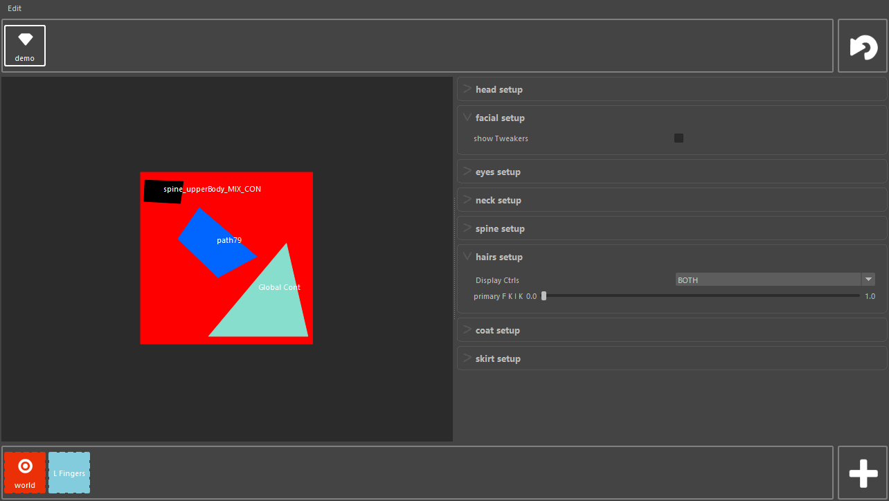

.. PickMe documentation master file, created by
   sphinx-quickstart on Mon Jan 10 12:12:12 2022.
   You can adapt this file completely to your liking, but it should at least
   contain the root `toctree` directive.

Welcome to PickMe's documentation!
==================================

============
Introduction
============

PickMe is a tool created to help animators by giving them a set of selection tools.

Features:
---------
* Picker
* Selection set manager (Global to the production and Local to user)
* Attribute editor

+-------------+-------------+
|DCC          | Support     |
+=============+=============+
|Maya 2022+   | WIP         |
+-------------+-------------+
|Houdini      | Not Planned |
+-------------+-------------+
|Blender      | Not Planned |
+-------------+-------------+
*Additionnal DCCs can be implemented as part as a comissioned work.*

.. toctree::
   :maxdepth: 2
   :caption: Contents:

   installation

   modules

   Sources <https://github.com/PiloeGAO/PickMe>

Indices and tables
==================

* :ref:`genindex`
* :ref:`modindex`
* :ref:`search`
