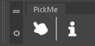

Installation
============

====
Maya
====
*Note: This tool is written in Python 3.7+, older versions than Maya 2022 are not supported.*

1. Unpack the release into a directory

2. Add the following line to 'Maya.env':

+------------+-------------------------------------------------------------------------+
| PYTHONPATH |"<unpack directory>/PickMe;<unpack directory>/PickMe/pickme/dccs/maya;"  |
+------------+-------------------------------------------------------------------------+

3. A new shelf called "PickMe" is automaticly added at launch.

==========
Standalone
==========
*For development purpose only*

1. Clone the repository [https://github.com/PiloeGAO/PickMe]
2. Create a virtual environment with required dependencies

.. code-block::

    pip install -r requirements.txt

3. Enter in the pickme directory and start the `main.py` file:

.. code-block::

    cd ./pickme
    python main.py