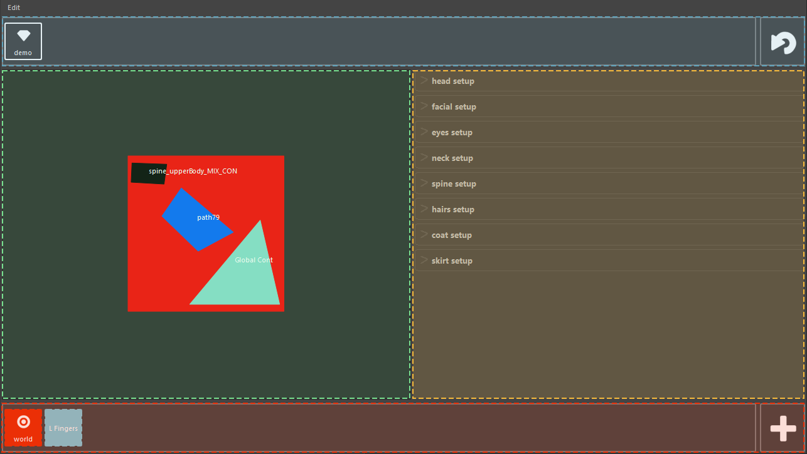
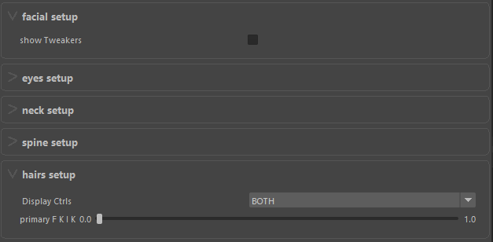

User Interface
==============

This section shows each area and defines their functionalities.

------------------------
Rig Selector (Blue area)
------------------------

*Area where all loaded rigs are displayed.*

The current rig is surrounded by the white border (here: demo).

You can use the button on the right to force reloading of the rig selector.

------------------------
Picker Area (Green area)
------------------------

*This is the part where you can setup the rig picker.*
*You can customize this area by editing the *.svg file corresponding to your picker group.*

This part can contain multiple pickers at once.

-------------------------------
Attributes Editor (Yellow area)
-------------------------------

*Area to display the attributes of the selected controller.*

Supported elements (exemple bellow):

* Slidder for floats
* Combobox for booleans (on/off switches)
* Dropdowns for multiple item selector

-------------------------
Selection Sets (Red area)
-------------------------

*Area where all selection sets are stored.*

You can add a new selection to *selection sets* by clicking on the "+" icon.